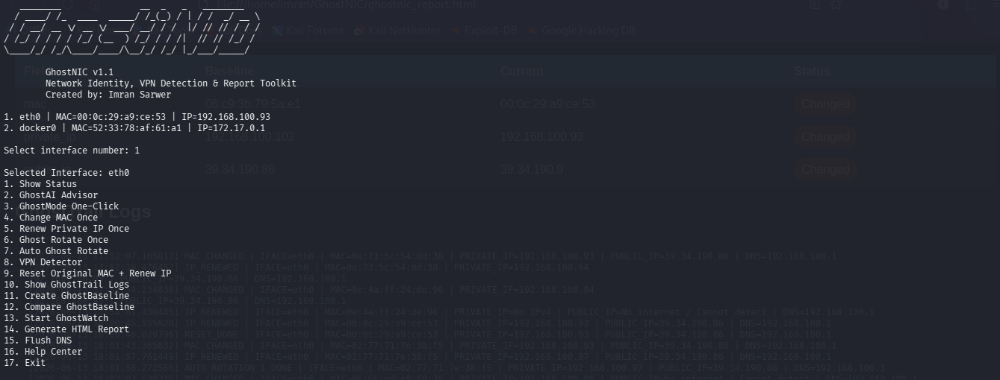
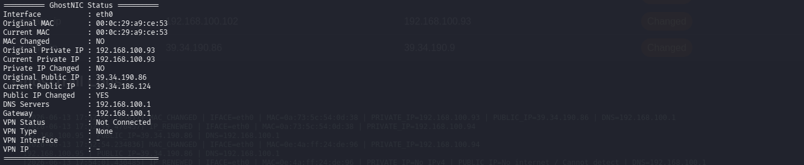
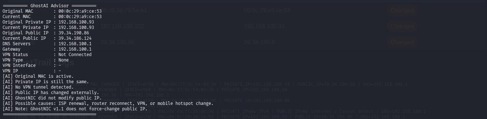
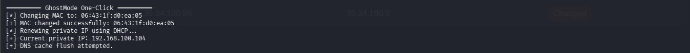
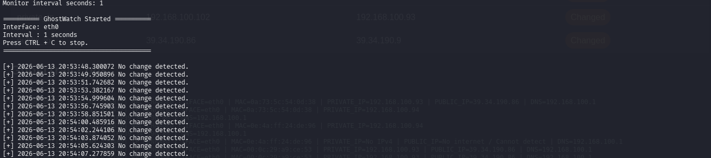
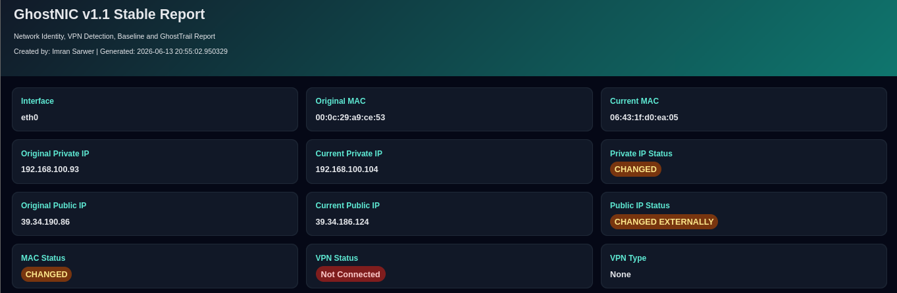

# GhostNIC v1.1 Stable

<p align="center">
  
</p>

<p align="center">
  <b>Network Identity, VPN Detection, Baseline Monitoring & HTML Reporting Toolkit</b>
</p>

<p align="center">
  Built for Cybersecurity Students, Blue Team Labs, SOC Learning, and Authorized Security Testing Environments.
</p>

---

## Overview

GhostNIC is a Linux-based network identity toolkit designed to help users monitor, analyze, and manage network identity information in authorized environments.

The tool combines MAC address management, private IP renewal, VPN detection, baseline comparison, live monitoring, AI-assisted analysis, and professional HTML reporting into a single easy-to-use interface.

GhostNIC was developed as a cybersecurity learning project with a focus on usability, visibility, and reporting.

---

## Key Features

### Identity Monitoring

* Original MAC Address Tracking
* Current MAC Address Monitoring
* Original Private IP Tracking
* Current Private IP Monitoring
* Original Public IP Tracking
* Current Public IP Monitoring
* DNS Server Detection
* Gateway Detection

### MAC Address Management

* Random MAC Address Generation
* One-Click MAC Rotation
* Original MAC Restoration
* MAC Change Verification

### IP Management

* DHCP Private IP Renewal
* Private IP Change Detection
* Network Identity Refresh

### VPN Detection

* WireGuard Detection
* OpenVPN Detection
* TAP Interface Detection
* PPP Interface Detection
* VPN Status Monitoring
* VPN Interface Discovery
* VPN IP Detection

### GhostAI Advisor

GhostAI Advisor provides human-readable analysis including:

* MAC Spoofing Status
* Private IP Change Detection
* VPN Tunnel Detection
* Public IP Change Analysis
* Network Identity Assessment

### GhostMode

One-click operation that automatically:

* Changes MAC Address
* Renews Private IP
* Flushes DNS Cache
* Runs GhostAI Analysis
* Saves Activity Logs

### GhostTrail Logging

Activity logging system that records:

* MAC Changes
* IP Renewals
* Resets
* Baseline Operations
* Monitoring Events
* Report Generation

### GhostBaseline

Create and compare network baselines.

Useful for:

* Security Labs
* SOC Training
* Environment Monitoring
* Configuration Verification

### GhostWatch

Real-time monitoring mode.

Detects changes in:

* MAC Address
* Private IP
* Public IP
* DNS Servers
* Gateway
* VPN Status

### Professional HTML Reports

Generate professional reports containing:

* Original vs Current Identity Information
* VPN Information
* Baseline Deviations
* GhostAI Summary
* GhostTrail Activity Logs
* Change Indicators

### Help Center

Built-in interactive documentation explaining every feature.

---

# Screenshots

## Main Menu


---

## Status Dashboard



---

## GhostAI Advisor



---

## GhostMode



---

## GhostWatch Monitoring



---

## HTML Report



---

# Installation

## Clone Repository

```bash
git clone https://github.com/YOUR-USERNAME/GhostNIC.git
cd GhostNIC
```

## Install Dependencies

```bash
sudo apt update

sudo apt install \
python3 \
isc-dhcp-client \
wireguard \
resolvconf \
-y
```

## Make Executable

```bash
chmod +x ghostnic.py
```

---

# Usage

## Interactive Mode

```bash
sudo python3 ghostnic.py
```

---

## Show Status

```bash
sudo python3 ghostnic.py -i eth0 --status
```

---

## Run GhostAI Advisor

```bash
sudo python3 ghostnic.py -i eth0 --ai
```

---

## Run GhostMode

```bash
sudo python3 ghostnic.py -i eth0 --ghostmode
```

---

## Change MAC Address

```bash
sudo python3 ghostnic.py -i eth0 --mac
```

---

## Renew Private IP

```bash
sudo python3 ghostnic.py -i eth0 --ip
```

---

## Auto Ghost Rotate

```bash
sudo python3 ghostnic.py -i eth0 --auto --interval 60 --count 5
```

---

## Create Baseline

```bash
sudo python3 ghostnic.py -i eth0 --baseline
```

---

## Compare Baseline

```bash
sudo python3 ghostnic.py -i eth0 --compare
```

---

## Start GhostWatch

```bash
sudo python3 ghostnic.py -i eth0 --watch --interval 30
```

---

## Generate HTML Report

```bash
sudo python3 ghostnic.py -i eth0 --report
```

Open report:

```bash
xdg-open ghostnic_report.html
```

---

## Open Help Center

```bash
sudo python3 ghostnic.py --help-center
```

---

# Project Structure

```text
GhostNIC/
│
├── ghostnic.py
├── README.md
├── requirements.txt
├── screenshots/
│   ├── main-menu.png
│   ├── status.png
│   ├── ghostai.png
│   ├── ghostmode.png
│   ├── ghostwatch.png
│   └── report.png
│
└── ghostnic_report.html
```

---

# Educational Use Cases

GhostNIC can be used for:

* Cybersecurity Learning
* SOC Training Labs
* Blue Team Practice
* Linux Networking Education
* Network Monitoring Demonstrations
* Identity Change Monitoring
* Baseline Analysis Exercises

---

# Important Notes

GhostNIC v1.1 does **not** force-change public IP addresses.

If a public IP change is detected, it is usually caused by:

* ISP Address Renewal
* Router Reconnection
* Mobile Hotspot Changes
* VPN Connections

GhostNIC only detects and reports such changes.

---

# Legal Disclaimer

This project is intended for:

* Educational Use
* Authorized Testing
* Personal Lab Environments
* Research Purposes

Users are responsible for complying with all applicable laws, policies, and authorization requirements.

Do not use this tool on networks or systems without permission.

---

# Future Roadmap

Planned future improvements:

* Export Reports to PDF
* Advanced Network Health Checks
* Multi-Interface Monitoring
* Enhanced Dashboard UI
* Additional Reporting Modules
* Improved GhostAI Recommendations

---

# Author

**Imran Sarwer**

Cybersecurity Student
Security Tools Developer
Blue Team & SOC Enthusiast

---

If you find this project useful, consider giving it a ⭐ on GitHub.
